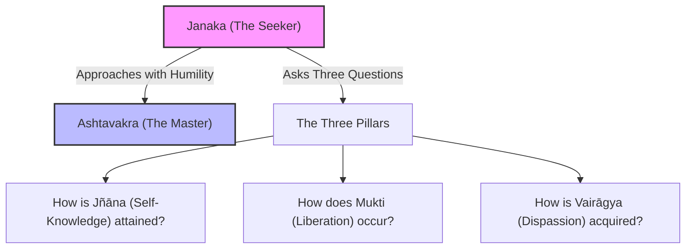

# Chapter 1, Verse 1 — Janaka's Inquiry: The Quest for Liberation

## 1. Sanskrit

Devanāgarī:
जनक उवाच ।
कथं ज्ञानमवाप्नोति कथं मुक्तिर्भविष्यति ।
वैराग्यं च कथं प्राप्तमेतद्ब्रूहि मम प्रभो ॥ १.१ ॥

IAST:
janaka uvāca |
kathaṃ jñānam avāpnoti kathaṃ muktir bhaviṣyati |
vairāgyaṃ ca kathaṃ prāptam etad brūhi mama prabho || 1.1 ||

---

## 2. Word-by-word

| Sanskrit | Root / grammar | Literal meaning | Notes |
|---|---|---|---|
| **janakaḥ** | Nominative singular masculine noun | King Janaka | The seeker, ruler of Mithila |
| **uvāca** | Verb, root *vac* (to speak), perfect tense, 3rd person singular | Said | Initiating the dialogue |
| **katham** | Interrogative adverb | How / in what manner | The quest for the method/means |
| **jñānam** | Accusative singular neuter noun from root *jñā* (to know) | Saving Knowledge | Transcendental self-knowledge (*ātma-jñāna*) |
| **avāpnoti** | Verb, root *āp* with prefix *ava* (to attain), present tense, 3rd person singular | Attains / is acquired | Seeking the attainment of realization |
| **katham** | Interrogative adverb | How | The quest for the cause of liberation |
| **muktiḥ** | Nominative singular feminine noun from root *muc* (to free) | Liberation / freedom | Release from the cycle of birth and death |
| **bhaviṣyati** | Verb, root *bhū* (to be), future tense, 3rd person singular | Will be / will occur | Inquiry into the future state of freedom |
| **vairāgyam** | Nominative singular neuter noun from *vi-rāga* + suffix *ya* | Dispassion / non-attachment | Freedom from worldly and celestial desires |
| **ca** | Conjunction | And | Linking the questions |
| **katham** | Interrogative adverb | How | Seeking the means of dispassion |
| **prāptam** | Past passive participle, root *āp* with prefix *pra*, neuter nom. sing. | Obtained / acquired | Seeking the acquisition of dispassion |
| **etad** | Accusative singular neuter pronoun | This | Referring to the three questions |
| **brūhi** | Verb, root *brū* (to speak), imperative, 2nd person singular | Tell / speak | Requesting direct instruction |
| **mama** | Personal pronoun *aham* (I), genitive singular (dative sense) | To me | Direct recipient of the teaching |
| **prabho** | Vocative singular masculine noun | O Lord / O Master | Address of deep respect and humility |

---

## 3. Open translation

King Janaka said:
"O Master, how is saving knowledge attained? How does liberation occur? And how is dispassion acquired? Tell me this!"

---

## 4. Literal reading

Janaka said: "How does one attain knowledge, how will liberation be, and how is dispassion obtained? Speak this to me, O Lord."

---

## 5. Philosophical meaning

This opening verse establishes the classic framework of a spiritual dialogue (*samvāda*). King Janaka, despite his immense material wealth and political power, recognizes the transience of the worldly kingdom and experiences a burning desire for ultimate freedom (*mumukṣutva*). He approaches the sage Aṣṭāvakra not as a monarch, but as a humble disciple addressing a master (*prabho*).

Janaka's inquiry addresses the three foundational pillars of spiritual realization in Indian philosophy:
1. **Vairāgya (Dispassion/Detachment)**: The turning away of attention from temporary, changing phenomena (*anātman*). It is the necessary prerequisite that quietens the mind.
2. **Jñāna (Self-Knowledge)**: The direct recognition of one's true nature as the changeless, ever-pure consciousness (*Ātman*).
3. **Mukti (Liberation)**: The natural consequence of knowledge, wherein the illusion of individual bondage and separate agency dissolves.

In Advaita Vedanta, these three are not separate sequential steps, but different facets of a single transformation of awareness.

---

## 6. Contemplative inquiry

To bring this inquiry into immediate, direct experience:
- **Examine Motivation**: Look closely at your current life. What is driving your search? Is it a desire for a new mental experience (which is temporary), or a deep pull to recognize that which is permanent and free?
- **Rest as the Witness**: Ask yourself: "Who is aware of the desires and thoughts that arise?" Notice that the thoughts come and go, but the *awareness* of them remains still and unaffected.
- **Inquire into Attachment**: Observe any object or concept you feel attached to. Inquire: "Does this object exist independently of my awareness of it? If it is temporary, can it define who I am?"

---

## 7. Visual map

---

## 8. Key concepts

- **mumukṣutva**: The intense desire for spiritual liberation.
- **vairāgya**: Dispassion; non-attachment to transient objects of experience.
- **jñāna**: Saving wisdom; direct realization of the nondual Self.
- **mukti**: Liberation from the illusion of limitation and separate egoic agency.
- **prabhu**: Literally "powerful lord," here representing spiritual mastery.

---

## 9. Cross-references

- **Bhagavad Gita 4.34**: *tad viddhi praṇipātena paripraśnena sevayā...* (Learn this by humble reverence, by inquiry, and by service to the wise).
- **Kaṭha Upanishad 1.2.1**: The distinction between *śreyas* (the spiritually good/liberating) and *preyas* (the worldly pleasant/binding).
- **Muṇḍaka Upanishad 1.2.12**: Examining the worlds gained by action, the wise seeker arrives at dispassion (*nirvedam āyāt*).

---

## 10. Scholarly notes

- **Swami Nityaswarupananda** notes that Janaka's questions represent the peak of spiritual readiness. He does not ask about rituals, deities, or ethics, but goes straight to the ultimate truth of existence [nityaswarupananda1940ashtavakra].
- **Swami Chinmayananda** points out that Janaka is already a ruler who has conquered his kingdom but realizes his inner poverty. By calling Ashtavakra *prabho* ("Lord"), Janaka surrenders his royal ego entirely, which is the essential prerequisite for receiving Advaita teachings [chinmayananda1993ashtavakra].
- **Osho** emphasizes that Janaka's question is not philosophical curiosity but a crisis of existence. He has realized the dream-like nature of his kingdom and wants to wake up immediately. Ashtavakra's teaching is direct because Janaka's question is direct and mature [osho1991ashtavakra].
- **Thomas Byrom** translates the questions with crisp, direct modern English, highlighting the clean, unadorned nature of the dialogue which bypasses all religious terminology [byrom1990heart].

---

## 11. Practice cautions

> [!WARNING]
> **Avoid Pseudo-Dispassion**: 
> Dispassion (*vairāgya*) is not a forced, emotional hatred of the world or physical suppression of desires. Forced renunciation leads to psychological repression and spiritual pride. True dispassion is a natural, peaceful cooling off that occurs when one directly realizes the absolute fullness of the Self. Approach this inquiry with gentle awareness, not mechanical force.

---

## 12. Contribution status

- Sanskrit checked: yes
- Grammar checked: yes
- Translation reviewed: yes
- Visual reviewed: yes
