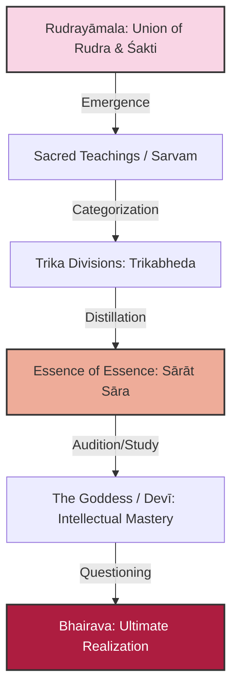

# Sutra 1 — The Goddess's Inquiry: Context & Motivation

## 1. Sanskrit

Devanāgarī:
श्रीदेव्युवाच ।
श्रुतं देव मया सर्वं रुद्रयामलसम्भवम् ।
त्रिकभेदमशेषेण सारात्सारविभागशः ॥ १ ॥

IAST:
śrī-devy uvāca |
śrutaṃ deva mayā sarvaṃ rudra-yāmala-sambhavam |
trika-bhedam aśeṣeṇa sārāt sāra-vibhāgaśaḥ || 1 ||

## 2. Word-by-word

| Sanskrit | Root / grammar | Literal meaning | Notes |
|---|---|---|---|
| **śrīdevī** | Nominative singular feminine noun compound (*śrī* + *devī*) | The Blessed/Auspicious Goddess | Bhairavī, representing energy/manifestation |
| **uvāca** | Verb, root *vac* (to speak), perfect tense, 3rd person singular | Said | Initiating the dialogue |
| **śrutam** | Past passive participle of root *śru* (to hear), nominative singular neuter | Heard | Refers to receiving revelation |
| **deva** | Vocative singular masculine noun | O Lord / O Divine One | Addressing Bhairava |
| **mayā** | Personal pronoun *aham* (I), instrumental singular | By me | The Goddess speaking in the first person |
| **sarvam** | Neuter singular accusative adjective | All / entire | Qualifies the teachings |
| **rudrayāmala-** | Compound noun (*rudra* + *yāmala*) | The union of Rudra and Śakti | An ancient, foundational Tantric scriptural corpus |
| **-sambhavam** | Accusative singular neuter adjective | Arisen from / born of | Modifies the teachings (*sarvam*) |
| **trikabhedam** | Compound noun (*trika* + *bheda*), accusative singular neuter | The divisions/aspects of Trika | The threefold system (Parā, Parāparā, Aparā) |
| **aśeṣeṇa** | Instrumental singular of *a-śeṣa* (without remainder) | Entirely / completely | Leaving nothing out |
| **sārāt-sāra-** | Ablative singular + nominative singular compound (*sāra*) | From the essence, the essence | Describing the refinement of the teachings |
| **-vibhāgaśaḥ** | Suffix *-śas* added to noun *vibhāga* (division) | Classified by essence / step-by-step | Categorized according to the core truth |

## 3. Open translation

The Blessed Goddess said:
O Divine Lord, I have heard in their entirety the teachings arisen from the union of Rudra and Śakti, including the divisions of the Trika system, classified according to their increasingly essential nature.

## 4. Literal reading

The Goddess tells the Lord that she has heard all the spiritual teachings that originated from the sacred text/union known as the *Rudrayāmala*, including all the classifications of the *Trika* school, divided and distilled from essence to further essence.

## 5. Philosophical meaning

This verse establishes the starting point of the scripture. The Goddess represents the dynamic, questioning aspect of consciousness (*Vimārśa*), while Bhairava represents the quiet, foundational aspect (*Prakāśa*). 
- **Rudrayāmala**: Refers to the union (*yāmala*) of Rudra (the terrible/dynamic) and his consort. It suggests that all teachings emerge from the nondual union of Shiva and Shakti.
- **Trika**: The threefold system (Shiva, Shakti, and Nara; or the three energies Parā, Parāparā, and Aparā). The Goddess acknowledges that she is already highly educated in the intellectual and ritual frameworks of these traditions. She is not asking as a beginner, but as an advanced seeker who has realized that theoretical classification (*vibhāga*) is not yet direct liberation (*mokṣa*).

## 6. Practice instruction

As an introductory verse, this is not a meditation gateway (*dhāraṇā*) itself, but a preparation of mindset:
1. Sit quietly and acknowledge the difference between intellectual knowledge (what you have "heard" or read) and direct realization (*vijñāna*).
2. Cultivate the attitude of the Goddess: a sincere, active, and respectful questioning of the ultimate nature of your own mind.
3. Observe how thoughts seek to classify reality into categories, and prepare to go beyond them.

## 7. Visual map

## 8. Key concepts

- **rudrayāmala**: The divine couple/union of opposites.
- **trika**: The threefold reality of Kashmir Shaivism.
- **sāra**: Essence or core of a spiritual teaching.
- **śruta**: Sacred hearing, oral lineage transmission.

## 9. Cross-references

- **Shiva Sutras 1.1**: *caitanyamātmā* (Awareness is the self).
- **Spanda Kārikā 1.1**: Bowing to Shankara, the source of the dynamic energy.
- **Pratyabhijñāhṛdayam Sutra 1**: *citiḥ svatantrā viśvasiddhihetuḥ* (Absolute Consciousness, of its own free will, is the cause of cosmic manifestation).

## 10. Scholarly notes

- Jaideva Singh notes that *Rudrayāmala* is a massive lost scripture, of which the VBT is considered to be the crowning portion or extract [singh1979vijnanabhairava].
- Swami Lakshmanjoo highlights that the Goddess represents the disciple, asking questions to reveal the truth for all humanity [lakshmanjoo2007vijnana].
- Christopher Wallis discusses the term *sārāt-sāra-vibhāgaśaḥ*, noting that the teachings are graded from gross to subtle, but the ultimate essence lies beyond all grades [wallis2018vbt].
- Osho interprets this opening dialogue not as an academic debate, but as a love dialogue between Shiva and Devi, representing the seeker's receptive, feminine attitude of surrender necessary to receive the transformation of consciousness [osho1998bookofsecrets].

## 11. Practice cautions

Ensure that your study of nondual philosophy does not become purely academic. Intellectual pride can block experiential realization. Approach these verses with humility.

## 12. Contribution status

- Sanskrit checked: yes
- Grammar checked: yes
- Translation reviewed: yes
- Visual reviewed: yes
