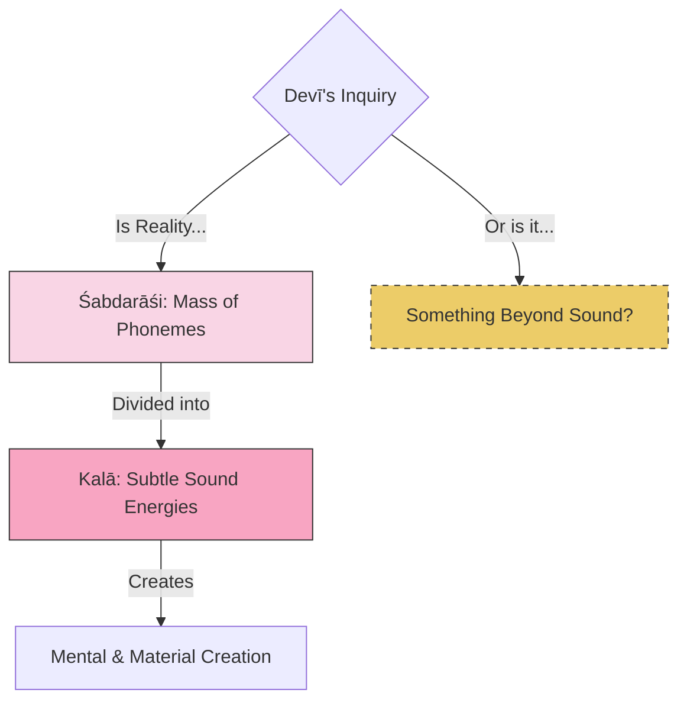

# Sutra 2 — The Nature of the Sound Corpus: Phonemic Reality

## 1. Sanskrit

Devanāgarī:
अद्यापि न निवृत्तो मे संशयः परमेश्वर ।
किं रूपं तत्त्वतो देव शब्दराशि-कलामयम् ॥ २ ॥

IAST:
adyāpi na nivṛtto me saṃśayaḥ parameśvara |
kiṃ rūpaṃ tattvato deva śabdarāśi-kalāmayam || 2 ||

## 2. Word-by-word

| Sanskrit | Root / grammar | Literal meaning | Notes |
|---|---|---|---|
| **adyāpi** | Compound of *adya* (today/now) + *api* (even) | Even now / to this day | Shows persisting inquiry |
| **na** | Negative particle | Not | Negation of completion |
| **nivṛttaḥ** | Past passive participle of *ni-vṛt* (to turn back/cease), nominative singular masculine | Dissolved / ceased / removed | Her doubt is still active |
| **me** | Pronoun *mad* (my), genitive singular (enclitic) | My | Belongs to the speaker |
| **saṃśayaḥ** | Nominative singular masculine noun | Doubt | The state of uncertainty |
| **parameśvara** | Vocative singular masculine compound (*parama* + *īśvara*) | O Supreme Lord | Respectful address to Bhairava |
| **kim** | Interrogative pronoun, nominative singular neuter | What? / Is it...? | Introducing the options |
| **rūpam** | Nominative singular neuter noun | Form / nature / identity | The ultimate form of Reality |
| **tattvataḥ** | Noun *tattva* + adverbial suffix *-tas* | In essence / in truth | From the standpoint of absolute reality |
| **deva** | Vocative singular masculine noun | O God / O Divine | Address of reverence |
| **śabdarāśi-** | Compound noun (*śabda* + *rāśi*) | The mass of sounds / letters of the alphabet | The Sanskrit phonemes (Mātṛkā) |
| **-kalāmayam** | Adjective suffix *-maya* added to compound word | Consisting of parts/energies | Dynamic aspect of phonemic energy |

## 3. Open translation

But even now, O Supreme Lord, my doubt has not been resolved. What is the true form of Reality, O Divine One? Does it consist of the cosmic array of sounds and their subtle energies?

## 4. Literal reading

The Goddess states that her doubt is not resolved. She asks if the essential nature of the Divine is composed of the whole collection of sounds (the Sanskrit alphabet, from A to Kṣa, representing *Mātṛkā*) and their associated digits/aspects/energies (*kalā*).

## 5. Philosophical meaning

The Goddess begins questioning specific esoteric doctrines. 
- **Śabdarāśi / Mātṛkā**: In Tantric cosmology, the universe is built of sound vibration. The letters of the Sanskrit alphabet (*Mātṛkā*) represent the primary phonemes or building blocks of creation. Each letter is associated with a specific power (*kalā*).
- **The doubt**: The Goddess is asking: Is the Ultimate Reality literally this cosmic grid of phonetic energy? Or is it something beyond the letters themselves? If Shiva/Bhairava is pure nondual consciousness, how can he be identical to a collection of distinct phonetic parts (*śabdarāśi*)?

## 6. Practice instruction

1. Sit in meditation and sound a single vowel, such as "A" (अ) or the nasal resonance "M" (म्).
2. Trace the physical sensation of the sound to the mental space where the thought of the sound arises.
3. Observe how the mind instantly attaches meaning, label, and division to the vibration.
4. Contemplate: "Is the ultimate source of my mind the sound itself, or the silent space that hears the sound?"

## 7. Visual map

## 8. Key concepts

- **śabdarāśi**: The corpus of sound, the letters of the alphabet.
- **mātṛkā**: The un-cognized creative sound matrix.
- **kalā**: The dynamic aspects or digits of energy.
- **saṃśaya**: Doubt, which is seen in Tantra as an engine for higher inquiry.

## 9. Cross-references

- **Shiva Sutras 1.4**: *jñānādhiṣṭhānaṃ mātṛkā* (The matrix of phonemes is the basis of limited knowledge).
- **Spanda Kārikā 3.45**: Describing how the deities of the letters (*Mātṛkās*) bind the individual soul.

## 10. Scholarly notes

- Jaideva Singh explains that *śabdarāśi* refers to the collection of letters from 'A' to 'Kṣa', and *kalā* refers to the manifest powers that spring from them [singh1979vijnanabhairava].
- Swami Lakshmanjoo notes that in the school of grammar (Vyākaraṇa), sound is considered the absolute (*Śabda-Brahman*), and Devī is checking if that is indeed the highest view in Trika [lakshmanjoo2007vijnana].
- Christopher Wallis notes that this query questions whether language and divine energy are co-extensive [wallis2018vbt].
- Osho notes that language and the letters of the alphabet are constructs of the mind. He points out that Shiva does not answer this philosophically because truth cannot be explained by words; instead, Shiva shifts from words to meditation techniques that bypass language [osho1998bookofsecrets].
- In modern video lectures, such as Bala Subramaniam's VBT series (Sutra 2: "The power behind the words"), the Goddess's question is explained as an inquiry into whether the ultimate reality is the words/letters themselves, or the supreme power that enlivens language. The lecture highlights that words are merely vehicles pointing toward the source, and the seeker must look beyond the semantic signs to realize the silent power behind them [subramaniam2026vbt].

## 11. Practice cautions

Vocalizing seed syllables or mantras should be done naturalistically. Avoid forcing the voice or straining the throat.

## 12. Contribution status

- Sanskrit checked: yes
- Grammar checked: yes
- Translation reviewed: yes
- Visual reviewed: yes
