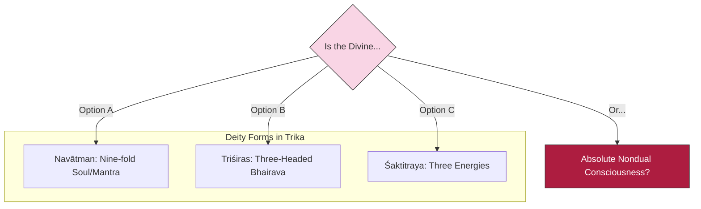

# Sutra 3 — Deities and Triadic Structures: Esoteric Forms

## 1. Sanskrit

Devanāgarī:
किं वा नवात्मभेदेन भैरवे भैरवाकृतौ ।
त्रिशिरोभेदभिन्नं वा किं वा शक्तित्रयात्मकम् ॥ ३ ॥

IAST:
kiṃ vā navātmabhedena bhairave bhairavākṛtau |
triśirobhedabhinnaṃ vā kiṃ vā śakti-trayātmakam || 3 ||

## 2. Word-by-word

| Sanskrit | Root / grammar | Literal meaning | Notes |
|---|---|---|---|
| **kim** | Interrogative pronoun | What? / Is it? | Continuing the alternatives |
| **vā** | Conjunction / particle | Or | Disjunctive options |
| **navātmabhedena** | Compound (*nava* + *ātman* + *bheda*), instrumental singular | By/through the nine-fold division | Referring to the nine-fold form of Bhairava |
| **bhairave** | Noun *bhairava*, locative singular | In Bhairava | Within this state or deity |
| **bhairavākṛtau** | Compound (*bhairava* + *ākṛti*), locative singular feminine | In the form of Bhairava | In his anthropomorphic or symbolic icon |
| **triśirobhedabhinnam** | Compound (*triśiras* + *bheda* + *bhinna*), nominative/accusative singular neuter | Differentiated by the three heads | Referring to the three-headed Bhairava (*Triśirobhairava*) |
| **vā** | Conjunction / particle | Or | Option link |
| **kim** | Interrogative pronoun | What? / Is it? | Alternative check |
| **vā** | Conjunction / particle | Or | Option link |
| **śaktitrayātmakam** | Compound (*śakti* + *traya* + *ātmaka*), nominative/accusative singular neuter | Consisting of the triad of Shaktis | The three dynamic powers (Parā, Parāparā, Aparā) |

## 3. Open translation

Or is it that Reality is to be found in the ninefold division of the form of Bhairava? Or is it differentiated by the three heads of the Triśirobhairava? Or is it composed of the triad of Shaktis?

## 4. Literal reading

The Goddess asks if Reality is represented by the nine-fold division (*navātman*) in the form of Bhairava, or by the three-headed deity (*triśiras*), or if it is essentially made of the three supreme energies/Shaktis (*śaktitraya*).

## 5. Philosophical meaning

The Goddess lists several highly specific deity configurations and theological structures from Tantric scriptures:
- **Navātman (Ninefold Soul)**: A key concept in scriptures like the *Netra Tantra* and the *Svacchanda Tantra*. It refers to the nine divisions of the deity's body (representing categories like intellect, ego, mind, and the five elements plus the self), or the nine-letter mantra of Bhairava (*h-r-kṣ-m-v-y-r-ū-m*).
- **Triśirobhairava (Three-headed Bhairava)**: The representation of the ultimate reality with three heads, symbolizing the three modes of consciousness: supreme (*parā*), intermediate (*parāparā*), and lower (*aparā*).
- **Śaktitraya (Triad of Energies)**: The three primary aspects of the Divine Mother (will - *icchā*, knowledge - *jñāna*, action - *kriyā*; or transcendence, immanence, and the union of both).
She is asking: "Are these ritualistic and symbolic forms of deities the actual truth, or are they just representations?"

## 6. Practice instruction

1. Sit quietly and look at any spiritual representation, deity image, or symbol you hold sacred.
2. Contemplate the symbol: "What makes this symbol powerful? Is it the wood, ink, or image itself, or is it the consciousness inside me that interprets and feels it?"
3. Mentally dissolve the symbol into the pure awareness that perceives it.
4. Rest in that space, noting how the three aspects of your experience—the perceiver, the perceived, and the act of perceiving—merge into one.

## 7. Visual map

## 8. Key concepts

- **navātman**: The ninefold aspect of divinity/mantra.
- **triśiras**: The three-headed form representing the three modes of reality.
- **śaktitraya**: The triad of powers (Will, Knowledge, Action).
- **ākṛti**: External form, image, or icon.

## 9. Cross-references

- **Shiva Sutras 1.3**: *yonivargaḥ kalāśarīram* (The source of letters and their divisions are the body of external form).
- **Spanda Kārikā 1.20**: Explaining how the primary triad of energies manifests the entire cosmos.

## 10. Scholarly notes

- Jaideva Singh provides a detailed breakdown of the *Navātman* mantra, mapping each letter to a specific tattva or stage of cosmic descent [singh1979vijnanabhairava].
- Swami Lakshmanjoo notes that *Triśiras* refers to the deity of the *Triśirobhairava Tantra*, which maps the absolute to three states: waking, dreaming, and deep sleep [lakshmanjoo2007vijnana].
- Christopher Wallis comments that the Goddess is testing if the absolute is represented by these anthropomorphic or multi-headed deities [wallis2018vbt].
- Osho points out that anthropomorphic deity forms (such as multi-headed figures or complex numerical divisions) are symbols constructed for the mind to focus on. They are psychological aids for devotion rather than the ultimate reality, which is entirely formless and beyond name [osho1998bookofsecrets].

## 11. Practice cautions

Esoteric visualizations should remain light and unstrained. Do not try to forcefully hold complex, multi-headed images in your mind if it causes mental tension.

## 12. Contribution status

- Sanskrit checked: yes
- Grammar checked: yes
- Translation reviewed: yes
- Visual reviewed: yes
