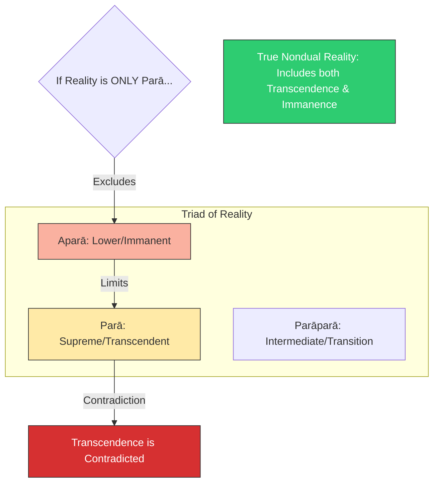

# Sutra 5 — Transcendence and Immanence: The Logical Contradiction

## 1. Sanskrit

Devanāgarī:
परापरायाः सकलमपरां च तथा पुनः ।
पराया यदि तत् स्यात् तत्त्वं तद्विरुध्यते ॥ ५ ॥

IAST:
parāparāyāḥ sakalamaparāṃ ca tathā punaḥ |
parāyā yadi tat syāt tattvaṃ tadvirudhyate || 5 ||

## 2. Word-by-word

| Sanskrit | Root / grammar | Literal meaning | Notes |
|---|---|---|---|
| **parāparāyāḥ** | Genitive/Ablative singular feminine of *parāparā* | Of the intermediate (transcendent-immanent) | The combination energy of both worlds |
| **sakalam** | Nominative/Accusative singular neuter of *sakala* (*sa* + *kalā*) | Composed of parts / manifest / immanent | Materiality, divisions |
| **aparām** | Accusative singular feminine of *aparā* | The lower / immanent / relative | The physical universe |
| **ca** | Conjunction | And | Linking terms |
| **tathā** | Indeclinable / adverb | Thus / also / in this way | Conjoining particle |
| **punaḥ** | Indeclinable / adverb | Again / further | Adding a point |
| **parāyāḥ** | Genitive/Ablative singular feminine of *parā* | Of the supreme / transcendent | Pure formless consciousness |
| **yadi** | Indeclinable particle | If | Conditional clause |
| **tat** | Neuter singular nominative pronoun | That | Referring to the ultimate state |
| **syāt** | Verb, root *as* (to be), optative/potential, 3rd person singular | Should be / would be | Conditional verb |
| **tattvaṃ** | Nominative singular neuter noun | The reality / truth / essence | The target of the search |
| **tadvirudhyate** | Sandhi compound: *tat* (that) + *virudhyate* (is opposed/contradicted) | That is contradicted | Logical conflict |

## 3. Open translation

Is the ultimate Reality manifest with parts (sakala), belonging to the intermediate energy (Parāparā) or the lower energy (Aparā)? Or, if Reality is exclusively the supreme transcendent energy (Parā), then that very transcendence becomes contradicted.

## 4. Literal reading

The Goddess queries if Reality is divided/material (*sakala*), appearing as the middle (*parāparā*) or the lower (*aparā*) aspect. She points out a logical problem: if the supreme Reality is only the transcendent (*parā*), then its nature of being all-encompassing (transcendent) is contradicted, because it would exclude the relative world.

## 5. Philosophical meaning

Here, the Goddess highlights the core logical dilemma of nondualism:
- **Parā (Transcendent)**: Pure, formless, quality-less awareness (*Nirguṇa*).
- **Aparā (Immanent)**: The world of objects, names, forms, and parts (*sakala*).
- **Parāparā (Intermediate)**: The bridge, where the formless manifests as form.
- **The Contradiction**: If the Ultimate Reality is *only* the supreme transcendent state (*parā*), it means it is completely separate from the physical world (*aparā*). But if it excludes the physical world, it is no longer "all-inclusive" or "absolute"—it is limited by what it excludes! Therefore, to be truly transcendent, it must also include the immanent. If it is divided into parts, it loses its undivided essence. The Goddess is showing the limits of logical categorizations.

## 6. Practice instruction

1. Sit quietly. Look at your hand. It is a physical object made of parts (fingers, skin, bone)—this is *aparā* (immanent).
2. Now, close your eyes and feel the raw sensation of the hand without looking at it. It becomes a field of warmth or tingling—this is *parāparā* (the transition from form to feeling).
3. Now, let go of the sensation of the hand entirely and rest in the empty space of awareness that is aware of both the hand and its absence—this is *parā* (transcendent).
4. Realize that all three stages are occurring within the same single consciousness. You cannot have the transcendent space without the immanent hand appearing in it. Contemplate the nondual union of form and emptiness.

## 7. Visual map

## 8. Key concepts

- **parā**: The transcendent, supreme aspect of consciousness.
- **aparā**: The immanent, manifest aspect of creation.
- **parāparā**: The intermediate aspect connecting formless to form.
- **sakala**: Manifest with parts or divisions.
- **tattva**: The reality or fundamental principle.

## 9. Cross-references

- **Shiva Sutras 1.2**: *jñānaṃ bandhaḥ* (Differentiated knowledge is bondage).
- **Spanda Kārikā 1.1**: The source which is both transcendent and immanent in the movement of the universe.
- **Bhagavad Gītā 15.18**: The Puruṣottama who transcends both the perishable (*kṣara*) and imperishable (*akṣara*).

## 10. Scholarly notes

- Jaideva Singh explains that if the supreme reality were only transcendent, it would be a dry, empty void, cut off from life, which contradicts the Trika view of Shiva as the fullness of all existence (*pūrṇatā*) [singh1979vijnanabhairava].
- Swami Lakshmanjoo notes that the Goddess uses logic to show that the absolute cannot be locked into any one of these three energies, but must transcend and yet include them all [lakshmanjoo2007vijnana].
- Christopher Wallis notes that this verse addresses the logical failure of dualistic transcendence, setting up Bhairava's answer that the supreme is not a category but a direct experience [wallis2018vbt].
- Osho explains that the Goddess's questioning exposes the logical trap of intellectual concepts: any definition of transcendence either excludes or divides the absolute. He notes that Shiva's response is not a logical theory but a set of practical methods (Tantra) to bypass the thinking mind altogether, resolving the intellectual contradiction through direct experience [osho1998bookofsecrets].

## 11. Practice cautions

Do not get trapped in intellectual circular thinking. Logic is a tool to show the limits of the mind; when logic shows a contradiction, relax the intellect and rest in silent presence.

## 12. Contribution status

- Sanskrit checked: yes
- Grammar checked: yes
- Translation reviewed: yes
- Visual reviewed: yes
